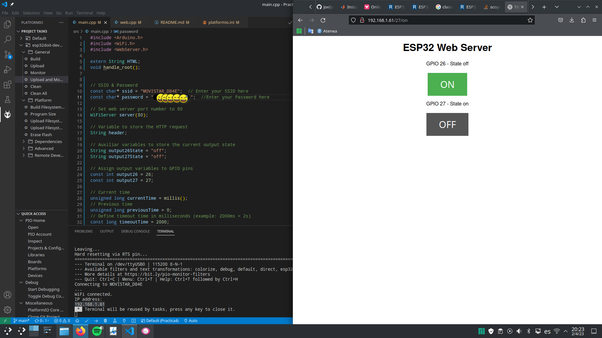
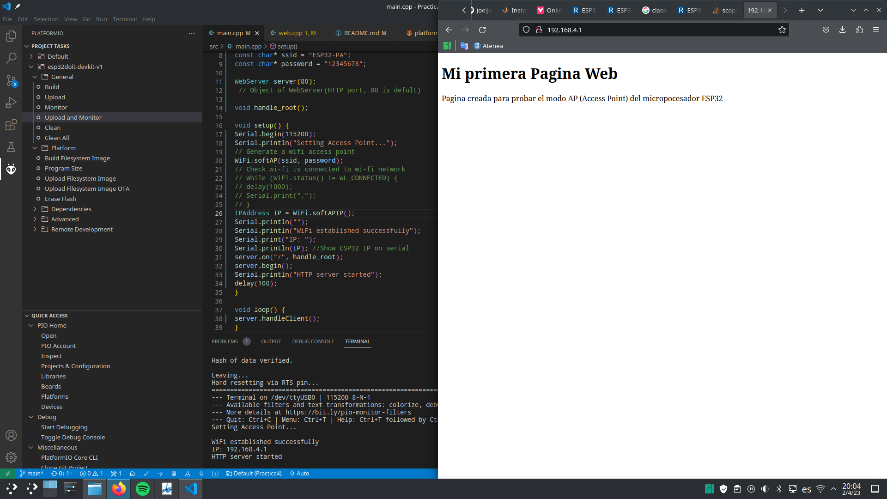
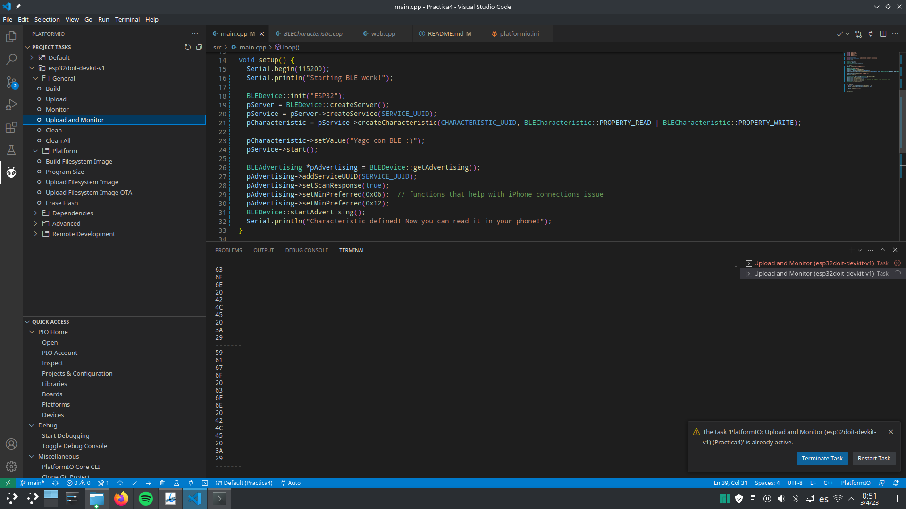
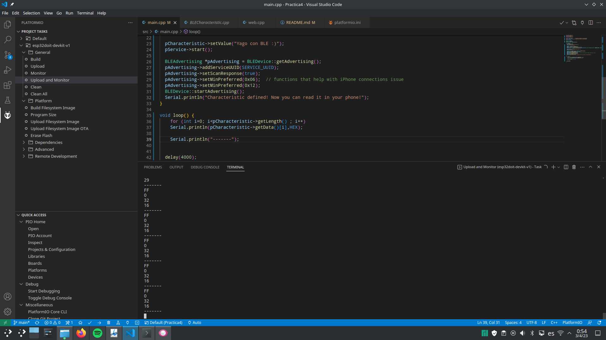

# Informe - Práctica 4
En esta práctica vamos a trabajar con el wifi y el bluetooth que nos ofrece el ESP32. 

Más concretamente vamos a crear un Webserver PA y otro STA (Para ver como configurar ambas opciones), donde ubicaremos un código *HTML* que nos permita enviar datos de estado de dos leds y recibir inputs de encendido y apagado de los mismos leds.

Después con el bluetooth crearemos una conexión entre un móvil android y nuestro microprocesador ESP32.

***
## Web Server - STA

El modo STA o *station* significa que nuestro **ESP32** se conectará a la red WiFi indicada para crear una comunicación http por el puerto indicado y en la IP que nos muestra, para establecer un *Web server* en modo STA deberemos conectar el **ESP32** a nuestro wifi, para ello usaremos las variables SSID y password para concectarnos. Después utilizaremos el puerto 80 para establecer la comunicación ya que está destinado a http. Usaremos el comando ```WiFi.begin(ssid, password);```para iniciar la conexión wifi con los datos ingresados anteriormente, y ```WiFi.localIP();```para obtener la IP donde se ubicará nuestra página de manera local.

### Codigo Wifi-STA
***
```cpp
#include <Arduino.h>
#include <WiFi.h>
#include <WebServer.h>

extern String HTML;
void handle_root();


// SSID & Password
const char* ssid = "MOVISTAR_D84E";  // Enter your SSID here
const char* password = "La_contraseña_:-)";  //Enter your Password here

// Set web server port number to 80
WiFiServer server(80);

// Variable to store the HTTP request
String header;

// Auxiliar variables to store the current output state
String output26State = "off";
String output27State = "off";

// Assign output variables to GPIO pins
const int output26 = 26;
const int output27 = 27;

// Current time
unsigned long currentTime = millis();
// Previous time
unsigned long previousTime = 0; 
// Define timeout time in milliseconds (example: 2000ms = 2s)
const long timeoutTime = 2000;

void setup() {
  Serial.begin(115200);
  // Initialize the output variables as outputs
  pinMode(output26, OUTPUT);
  pinMode(output27, OUTPUT);
  // Set outputs to LOW
  digitalWrite(output26, LOW);
  digitalWrite(output27, LOW);

  // Connect to Wi-Fi network with SSID and password
  Serial.print("Connecting to ");
  Serial.println(ssid);
  WiFi.begin(ssid, password);
  while (WiFi.status() != WL_CONNECTED) {
    delay(500);
    Serial.print(".");
  }
  // Print local IP address and start web server
  Serial.println("");
  Serial.println("WiFi connected.");
  Serial.println("IP address: ");
  Serial.println(WiFi.localIP());
  server.begin();
}

void loop(){
  WiFiClient client = server.available();   // Listen for incoming clients

  if (client) {                             // If a new client connects,
    currentTime = millis();
    previousTime = currentTime;
    Serial.println("New Client.");          // print a message out in the serial port
    String currentLine = "";                // make a String to hold incoming data from the client
    while (client.connected() && currentTime - previousTime <= timeoutTime) {  // loop while the client's connected
      currentTime = millis();
      if (client.available()) {             // if there's bytes to read from the client,
        char c = client.read();             // read a byte, then
        Serial.write(c);                    // print it out the serial monitor
        header += c;
        if (c == '\n') {                    // if the byte is a newline character
          // if the current line is blank, you got two newline characters in a row.
          // that's the end of the client HTTP request, so send a response:
          if (currentLine.length() == 0) {
            // HTTP headers always start with a response code (e.g. HTTP/1.1 200 OK)
            // and a content-type so the client knows what's coming, then a blank line:
            client.println("HTTP/1.1 200 OK");
            client.println("Content-type:text/html");
            client.println("Connection: close");
            client.println();
            
            // turns the GPIOs on and off
            if (header.indexOf("GET /26/on") >= 0) {
              Serial.println("GPIO 26 on");
              output26State = "on";
              digitalWrite(output26, HIGH);
            } else if (header.indexOf("GET /26/off") >= 0) {
              Serial.println("GPIO 26 off");
              output26State = "off";
              digitalWrite(output26, LOW);
            } else if (header.indexOf("GET /27/on") >= 0) {
              Serial.println("GPIO 27 on");
              output27State = "on";
              digitalWrite(output27, HIGH);
            } else if (header.indexOf("GET /27/off") >= 0) {
              Serial.println("GPIO 27 off");
              output27State = "off";
              digitalWrite(output27, LOW);
            }
            
            // Display the HTML web page
            client.println("<!DOCTYPE html><html>");
            client.println("<head><meta name=\"viewport\" content=\"width=device-width, initial-scale=1\">");
            client.println("<link rel=\"icon\" href=\"data:,\">");
            // CSS to style the on/off buttons 
            // Feel free to change the background-color and font-size attributes to fit your preferences
            client.println("<style>html { font-family: Helvetica; display: inline-block; margin: 0px auto; text-align: center;}");
            client.println(".button { background-color: #4CAF50; border: none; color: white; padding: 16px 40px;");
            client.println("text-decoration: none; font-size: 30px; margin: 2px; cursor: pointer;}");
            client.println(".button2 {background-color: #555555;}</style></head>");
            
            // Web Page Heading
            client.println("<body><h1>ESP32 Web Server</h1>");
            
            // Display current state, and ON/OFF buttons for GPIO 26  
            client.println("<p>GPIO 26 - State " + output26State + "</p>");
            // If the output26State is off, it displays the ON button       
            if (output26State=="off") {
              client.println("<p><a href=\"/26/on\"><button class=\"button\">ON</button></a></p>");
            } else {
              client.println("<p><a href=\"/26/off\"><button class=\"button button2\">OFF</button></a></p>");
            } 
               
            // Display current state, and ON/OFF buttons for GPIO 27  
            client.println("<p>GPIO 27 - State " + output27State + "</p>");
            // If the output27State is off, it displays the ON button       
            if (output27State=="off") {
              client.println("<p><a href=\"/27/on\"><button class=\"button\">ON</button></a></p>");
            } else {
              client.println("<p><a href=\"/27/off\"><button class=\"button button2\">OFF</button></a></p>");
            }
            client.println("</body></html>");
            
            // The HTTP response ends with another blank line
            client.println();
            // Break out of the while loop
            break;
          } else { // if you got a newline, then clear currentLine
            currentLine = "";
          }
        } else if (c != '\r') {  // if you got anything else but a carriage return character,
          currentLine += c;      // add it to the end of the currentLine
        }
      }
    }
    // Clear the header variable
    header = "";
    // Close the connection
    client.stop();
    Serial.println("Client disconnected.");
    Serial.println("");
  }
}
```
***
### Salida del cógido Wifi-STA
```
Connecting to MOVISTAR_D84E
...
WiFi connected.
IP address: 
192.168.1.61
```
***
### Resultado Wifi-STA

***
### Diagrama de flujo Wifi-STA
```mermaid
flowchart TD

    A[Inicio] --> B(Declarar variables globales)
    B --> C("WiFiServer server(80)")
    C --> void_setup
    void_setup --> H1{{"void loop()"}}
    H1 --> I1("WiFiClient client = server.available()")
    I1 --> J1{"if(client)"}
    J1 --> |NO|H1
    J1 --> |YES|K1(Declaración de variables locales)
    K1 --> L1(("while (client.connected())"))
    L1 --> |TRUE|M1{"if(client.available())"}
    M1 --> |NO|L1
    M1 --> |YES|O1("char c = client.read()")
    O1 --> D("header += c")
    D --> F{"if(c == '\n')"}
    F --> |NO|G{"else if (c != '\r')"}
    G --> |NO|L1
    G --> |YES|H("currentLine += c")
    H --> L1
    F --> |YES|I{"if(currentLine.length()==0)"}
    I --> |NO|J("else currentLine = ''")
    J --> L1
    I --> |YES|K("Leyendo los valores de estado de los pines mandará un código html u otro (HTML web page)")
    K --> L1
    L1 --> |FALSE|L("header = ' '")
    L --> M("client.stop()")
    M --> N("Serial.println('Client disconnected.')")
    N --> H1

    subgraph void_setup

        A1(Serial.begin) --> B1(Initializar variables de salida)
        B1 --> C1("WiFi.begin(ssid, password)")
        C1 --> D1("while(status != connected)")
        D1 --> E1("Serial.print( '.' )")
        E1 --> D1
        D1 --> F1("Serial.println(WiFi.localIP())")
        F1 --> G1("server.begin()")

    end
```
***
## Web Server - AP
El modo AP o *Access Point* del *Web Server* del **ESP32** significa que el microprocesador creará su propia red WiFi donde los dispositivos que quieran establecer una comunicación con este se deberán conectar poniendo el nombre (SSID) y la contraseña que hayamos configurado.
***
### Código Wifi-AP
```cpp
#include <Arduino.h>
#include<WebServer.h>
#include<WiFi.h>

extern String HTML;

// SSID & Password
const char* ssid = "ESP32-PA";
const char* password = "12345678";

WebServer server(80);
 // Object of WebServer(HTTP port, 80 is defult)

void handle_root();

void setup() {
Serial.begin(115200);
Serial.println("Setting Access Point...");

// Generate a wifi access point
WiFi.softAP(ssid, password);

IPAddress IP = WiFi.softAPIP();
Serial.println("");
Serial.println("WiFi established successfully");
Serial.print("IP: ");
Serial.println(IP); //Show ESP32 IP on serial
server.on("/", handle_root);
server.begin();
Serial.println("HTTP server started");
delay(100);
}

void loop() {
server.handleClient();
}

// Handle root url (/)
void handle_root() {
server.send(200, "text/html", HTML);
}
```
### Codigo HTML
```html
String HTML = 
"<!DOCTYPE html> "
"<html> "
"<body> "
"<h1> Mi primera Pagina Web </h1> "
"<p> Pagina creada para probar el modo AP (Access Point) del micropocesador ESP32 </p>"
"</body> "
"</html>";
```
***
### Salida del cógido Wifi-AP
```
Setting Access Point...

WiFi established successfully
IP: 192.168.4.1
HTTP server started
```
***
### Resultado Wifi-AP

***
### Diagrama de flujo Wifi-AP
```mermaid
flowchart TD

    A[Inicio] --> B(Declarar constantes)
    B --> C("WebServer server(80)")
    C --> D("void handle_root()")
    D --> void_setup
    void_setup --> E{{"void loop()"}}
    E --> F("server.handleClient()")
    F --> E

    subgraph void_setup

        A1(Serial.begin) --> B1("Wifi.softAP(ssid,password)")
        B1 --> C1("Serial.println(WiFi.softAPIP())")
        C1 --> D1("server.on(' / ', handle_root)")
        D1 --> E1("server.begin()")

    end
```
***
## Bluetooth - Classic
Estableceremos una comunicación serie entre el microprocesador y un móvil donde hemos instalar una aplicación.

***
### Código Bluetooth-Classic
```cpp
#include <Arduino.h>
#include "BluetoothSerial.h"

#if !defined(CONFIG_BT_ENABLED) || !defined(CONFIG_BLUEDROID_ENABLED)
#error Bluetooth is not enabled! Please run `make menuconfig` to and enable it
#endif
// Las tres línea anteriores comprueban que el Bluetooth esté correctamente habilitado.

BluetoothSerial SerialBT;

void setup() {
  Serial.begin(115200);
  SerialBT.begin("ESP32test"); //Inicializamos Bluetooth con un nombre de dispositivo
  Serial.println("The device started, now you can pair it with bluetooth!");
}

void loop() { //Aqui mandamos y recibimos información
  if (Serial.available()) { //Si hay bytes recibidos al móvil
    SerialBT.write(Serial.read()); //Escribimos esos datos via bluetooth al móvil
  }
  if (SerialBT.available()) { //Si hay bytes recibidos en el ESP32
    Serial.write(SerialBT.read()); //Los enviamos para ser impresos por pantalla
  }
  delay(20);
}
```
***
### Salida del cógido Bluetooth-Classic


***
### Diagrama de flujo Bluetooth-Classic
```mermaid
flowchart TD

    A[Inicio] --> B(Declarar mensajes de error)
    B --> C("BluetoothSerial SerialBT")
    C --> void_setup
    void_setup --> D{{"void loop()"}}
    D --> E("if (Serial.available())")
    D --> F("if (SerialBT.available()) ")
    E --> G("delay(20)")
    F --> G
    G --> D

    subgraph void_setup

        A1(Serial.begin) --> B1("SerialBT.begin('ESP32test')")
        B1 -->C1("Serial.println()")

    end
```
***
## Bluetooth - BLE
En Bluetooth de Baja Energía los dispositivos pueden ser clientes o servidores. El servidor es encargado de emitir los servicios y el cliente de recibirlos.

En este programa lo que hace es crear un servicio dentro del ESP32 que estará en modo servidor. Este servicio tendrá dos caracterísitcas con el mismo UUID, que servirán para enviar y recibir información (bytes).

El funcionamiento es algo diferente respecto al *Bluetooth Classic*. Debemos inicializar el dispositivo para BLE, crear un Server dentro, añadir un servicio dentro del servidor, y al servicio le añadimos características, a una de ellas la inicializaremos con una cadena de caracteres la cual veremos en formato hexadecimal: "Yago con BLE :)" será (0x 59-61-67-6F-20-63-6F-6E-20-42-4C-45-20-3A-29). Para ejecutar el servicio utilizaremos el Advertising que es para que el server sea visto por los dispositivos clientes que quieran establecer conexión.

En el loop imprimiremos por pantalla el valor de la característica que hemos creado para ver como el dispostivo cliente puede modificarlo.

***
### Codigo Bluetooth-BLE SERVER
```cpp
#include <Arduino.h>
#include <BLEDevice.h>
#include <BLEUtils.h>
#include <BLEServer.h>

#define SERVICE_UUID        "4fafc201-1fb5-459e-8fcc-c5c9c331914b"
#define CHARACTERISTIC_UUID "beb5483e-36e1-4688-b7f5-ea07361b26a8"
#define PIN 26

BLEServer *pServer;
BLEService *pService;
BLECharacteristic *pCharacteristic;

void setup() {
  Serial.begin(115200);
  Serial.println("Starting BLE work!");

  BLEDevice::init("ESP32");
  pServer = BLEDevice::createServer();
  pService = pServer->createService(SERVICE_UUID);
  pCharacteristic = pService->createCharacteristic(CHARACTERISTIC_UUID, BLECharacteristic::PROPERTY_READ | BLECharacteristic::PROPERTY_WRITE);

  pCharacteristic->setValue("Yago con BLE :)");
  pService->start();
  
  BLEAdvertising *pAdvertising = BLEDevice::getAdvertising();
  pAdvertising->addServiceUUID(SERVICE_UUID);
  pAdvertising->setScanResponse(true);
  pAdvertising->setMinPreferred(0x06);  // functions that help with iPhone connections issue
  pAdvertising->setMinPreferred(0x12);
  BLEDevice::startAdvertising();
  Serial.println("Characteristic defined! Now you can read it in your phone!");
}

void loop() {
    for (int i=0; i<pCharacteristic->getLength() ; i++)
    Serial.println(pCharacteristic->getData()[i],HEX);

    Serial.println("-------");


  delay(4000);
}
```
***
### Salida del cógido Bluetooth-BLE SERVER
READ



WRITE




***
